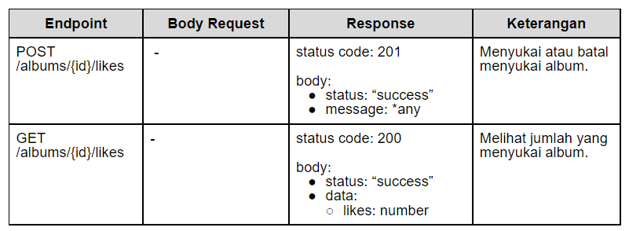

[class-link]: https://www.dicoding.com/academies/271
[pm-v1]: https://github.com/dicodingacademy/a271-backend-menengah-labs/raw/099-shared-files/03-submission-content/01-open-music-api-v1/OpenMusic%20API%20V1%20Test.zip
[pm-v2]: https://github.com/dicodingacademy/a271-backend-menengah-labs/raw/099-shared-files/03-submission-content/02-open-music-api-v2/OpenMusic%20API%20V2%20Test.zip
[pm-v3]: https://github.com/dicodingacademy/a271-backend-menengah-labs/raw/099-shared-files/03-submission-content/03-open-music-api-v3/OpenMusic%20API%20V3%20Test.zip
[my-consumer]: https://github.com/KeidsID/dicoding-back-end-intermediate-mq-consumer

# dicoding-back-end-intermediate

Project task from [dicoding.com Back-End Intermediate Class][class-link].

This project is a learning outcome through the platform dicoding.com. The aim is to enable students to create a RestfulAPI rich in features, including data validations, database relations, auth with JWT Token, MQ, File Storage, and Server-Side Cache.

Link to MQ Consumer: [dicoding-back-end-intermediate-mq-consumer][my-consumer]

### **Postman collections and envs for testing this project:**

- [API.v1 test zip][pm-v1].
- [API.v2 test zip][pm-v2].
- [API.v3 test zip][pm-v3].

### **List of README.md Contents:**

- [Project Set Up](#project-set-up)
- [TO DO API.v1](#to-do-apiv1)
- [TO DO API.v1 Details](#to-do-apiv1-details)
- [TO DO API.v2](#to-do-apiv2)
- [TO DO API.v2 Details](#to-do-apiv2-details)
- [TO DO API.v3](#to-do-apiv3)
- [TO DO API.v3 Details](#to-do-apiv3-details)

# Project Set Up

- Create the "**.env**" file with the following data below:

  ```sh
  # Server config
  HOST=localhost
  PORT=<desired port>

  # node-postgres config
  PGUSER=<your psql user>
  PGHOST=<your psql host>
  PGPASSWORD=<your psql password>
  PGDATABASE=<your psql database name>
  PGPORT=<your psql port>

  # JWT config
  ACCESS_TOKEN_KEY=<random string>
  REFRESH_TOKEN_KEY=<random string>
  ACCESS_TOKEN_AGE=<duration in ms>

  # RabbitMQ config
  RABBITMQ_SERVER=<your RabbitMQ server>

  # Redis config
  REDIS_SERVER=<your Redis host>
  ```

- Then run this command
  ```
  npm install
  npm run pgm up
  ```

**Note**:

If you do TRUNCATE tables, make sure to re-add default album data (id: album-unknown) into "**albums**" table.

```sql
INSERT INTO albums(id, name, year)
VALUES('album-unknown', 'Unknown', 1945)
```

OR

Re-migrations from "**./migrations/1676095171675_add-constraint-on-songs-table.js**".

# TO DO API.v1

[See TO DO API.v1 Details](#to-do-apiv1-details).

## Mandatory Tasks

- [x] Albums endpoint.
- [x] Songs endpoint.
- [x] Data validation.
- [x] Error handling.
- [x] Using Database.

## Optional Tasks

- [x] "/albums/{id}" endpoint response array of Song on Album too.
- [x] Query params for songs endpoint.

# TO DO API.v2

[See TO DO API.v2 Details](#to-do-apiv2-details).

## Mandatory Tasks

- [x] Registration and Authentication Users.
- [x] Playlist endpoint.
- [x] Implement Foreign Key on Database Tables.
- [x] Data validation for new endpoints.
- [x] Error handling for new endpoints.
- [x] Keep features from API.v1.

## Optional Tasks

- [x] Collaborations on Playlists Feature.
- [x] Activities endpoint for Playlist Log History.
- [x] Keep optional features from API.v1.

# TO DO API.v3

[See TO DO API.v3 Details](#to-do-apiv3-details).

## Mandatory Tasks

- [x] Export playlist feature. MQ Consumer: [dicoding-back-end-intermediate-mq-consumer][my-consumer]
- [x] Upload album cover feature.
- [x] Like and Unlike albums feature.
- [ ] Server-Side cache.
- [x] Keep features from API.v2.

## Optional Tasks

No optional task yay.

# TO DO API.v1 Details

<p align="center">
  <a href="#dicoding-back-end-intermediate">Back to Top</a> |
  <a href="#optional-tasks-3">Optional Tasks</a> |
  <a href="#to-do-apiv2-details">TO DO API.v2 Details</a> |
  <a href="#to-do-apiv3-details">TO DO API.v3 Details</a>
</p>

## Mandatory Tasks

### **1. Albums Endpoint**


<p align="center">*any: Any <b>string,</b> but not <b>null</b>.</p>

Album obj structure:

```json
{
  "id": "album-<unique-id-here>",
  "name": "lorem ipsum",
  "year": 2012
}
```

### **2. Songs Endpoint**


<p align="center">*any: Any <b>string,</b> but not <b>null</b>.</p>
<p align="center">*?: Can be <b>null</b> or <b>undefined</b>.</p>

Song obj structures:

- Main structure.

```json
{
  "id": "song-<unique-id-here>",
  "title": "Lorem Ipsum",
  "year": 2008,
  "performer": "John Doe",
  "genre": "Indie",
  "duration": 120,
  "albumId": "album-id"
}
```

- Only for GET /songs endpoint.

```json
{
  "id": "song-<unique-id-here>",
  "title": "Life in Technicolor",
  "performer": "Coldplay"
}
```

### **3. Data Validations**

- POST /albums

  - **name**: string, required.
  - **year**: number, required.

- PUT /albums

  - **name**: string, required.
  - **year**: number, required.

- POST /songs

  - **title**: string, required.
  - **year**: number, required.
  - **genre**: string, required.
  - **performer**: string, required.
  - **duration**: number.
  - **albumId**: string.

- PUT /songs
  - **title**: string, required.
  - **year**: number, required.
  - **genre**: string, required.
  - **performer**: string, required.
  - **duration**: number.
  - **albumId**: string.

### **4. Error Handling**

- Validation Error Response:
  - status code: **400 (Bad Request)**
  - response body:
    ```json
    {
      "status": "fail",
      "message": <any but not null>,
    }
    ```
- Not Found Error Response:
  - status code: **404 (Not Found)**
  - response body:
    ```json
    {
      "status": "fail",
      "message": <any but not null>,
    }
    ```
- Server Error Response:
  - status code: **500 (Internal Server Error)**
  - response body:
    ```json
    {
      "status": "error",
      "message": <any but not null>,
    }
    ```

### **5. Using Database**

- Use PostgreSQL to store data. So the data will not be lost if the server is down.

- Use [dotenv](https://www.npmjs.com/package/dotenv) to manage environment variables that store credentials for accessing database.

## Optional Tasks

<p align="center">
  <a href="#dicoding-back-end-intermediate">Back to Top</a> |
  <a href="#to-do-apiv1-details">Back to Mandatory Tasks</a> |
  <a href="#to-do-apiv3-details">TO DO API.v3 Details</a>
</p>

### **1. "/albums/{id}" endpoint response array of Song on Album too**

Example:

```json
{
  "status": "success",
  "data": {
    "album": {
      "id": "album-Mk8AnmCp210PwT6B",
      "name": "Viva la Vida",
      "year": 2008,
      "songs": [
        {
          "id": "song-Qbax5Oy7L8WKf74l",
          "title": "Life in Technicolor",
          "performer": "Coldplay"
        }
      ]
    }
  }
}
```

### **2. Query Params for Songs Endpoint**

Make the **GET /songs** support query params for searching.

- **?title**: Search song based on title.
- **?performer**: Search song based on performer.

**Note**: Both queries can be combined ( ".../songs?title=lmao&performer=pisan" )

# TO DO API.v2 Details

<p align="center">
  <a href="#dicoding-back-end-intermediate">Back to Top</a> |
  <a href="#optional-tasks-4">Optional Tasks</a> |
  <a href="#to-do-apiv1-details">TO DO API.v1 Details</a> |
  <a href="#to-do-apiv3-details">TO DO API.v3 Details</a>
</p>

## Mandatory Tasks

### **1. Registration and Authentication Users**


<p align="center">*any: Any <b>string,</b> but not <b>null</b>.</p>

**Conditions**:

- **Username** must unique.
- Using JWT token for Auth.
- JWT token payload contains **userId**.
- JWT token secret key value stored on envs as **ACCESS_TOKEN_KEY** and **REFRESH_TOKEN_KEY**.

### **2. Playlist endpoint**


<p align="center">*any: Any <b>string,</b> but not <b>null</b>.</p>

**Conditions**:

- **Restrict** endpoint (Need "access token" to access).
- **GET /playlists** returns owned playlists (And collab playlists if exist).
- Collaborator (if exist) can access **songs** (add, get, and delete) from playlist, but only owners can delete their own playlists.
- Only valid **songId** can be add/delete to/from playlist.

**Responses**:

- GET /playlists

```json
{
  "status": "success",
  "data": {
    "playlists": [
      {
        "id": "playlist-Qbax5Oy7L8WKf74l",
        "name": "Lagu Indie Hits Indonesia",
        "username": "dicoding"
      },
      {
        "id": "playlist-lmA4PkM3LseKlkmn",
        "name": "Lagu Untuk Membaca",
        "username": "dicoding"
      }
    ]
  }
}
```

- GET /playlists/{id}/songs

```json
{
  "status": "success",
  "data": {
    "playlist": {
      "id": "playlist-Mk8AnmCp210PwT6B",
      "name": "My Favorite Coldplay",
      "username": "dicoding",
      "songs": [
        {
          "id": "song-Qbax5Oy7L8WKf74l",
          "title": "Life in Technicolor",
          "performer": "Coldplay"
        },
        {
          "id": "song-poax5Oy7L8WKllqw",
          "title": "Centimeteries of London",
          "performer": "Coldplay"
        },
        {
          "id": "song-Qalokam7L8WKf74l",
          "title": "Lost!",
          "performer": "Coldplay"
        }
      ]
    }
  }
}
```

**Obj Playlist for Database**:

```json
{
  "id": "playlist-Qbax5Oy7L8WKf74l",
  "name": "Lagu Indie Hits Indonesia",
  "owner": "user-Qbax5Oy7L8WKf74l"
}
```

### **3. Implement Foreign Key**

- Table **songs** related to **albums**.
- Table **playlists** related to **users**.
- etc.

### **4. Data Validation**

- POST /users

  - **username**: string, required.
  - **password**: string, required.
  - **fullname**: string, required.

- POST /authentications

  - **username**: string, required.
  - **password**: string, required.

- PUT /authentications

  - **refreshToken**: string, required.

- DELETE /authentications

  - **refreshToken**: string, required.

- POST /playlists

  - **name**: string, required.

- POST /playlists/{playlistId}/songs

  - **songId**: string, required.

### **5. Error Handling**

The previous error handler is still in use, but there is a new handler for Auth.

- Authorization Error:
  - status code: **401 (Unauthorized)**
  - response body:
    ```json
    {
      "status": "fail",
      "message": <Any, but not null>
    }
    ```
- Restrict Error:
  - status code: **403 (Forbidden)**
  - response body:
    ```json
    {
      "status": "fail",
      "message": <Any, but not null>
    }
    ```

### **6. Keep Features from API.v1**

- Albums Feature.
- Songs Feature.
- Validations for Songs and Albums Endpoints.

## Optional Tasks

<p align="center">
  <a href="#dicoding-back-end-intermediate">Back to Top</a> |
  <a href="#to-do-apiv2-details">Back to Mandatory Tasks</a> |
  <a href="#to-do-apiv1-details">TO DO API.v1 Details</a> |
  <a href="#to-do-apiv3-details">TO DO API.v3 Details</a>
</p>

### **1. Playlists Collaboration Feature**


<p align="center">*any: Any <b>string,</b> but not <b>null</b>.</p>

**Conditions**:

- Only the owner of the playlist can add or remove collaborators from the playlist.

**Collaborator access rights**:

- Collaborated playlists also shown on "GET /playlists" endpoint data.
- Can add/get/delete songs to/from playlist.
- Can see playlist activities too (If already implemented).

### **2. Activities endpoint for Playlist Log History**

This feature is used to record the history of **adding and removing** **songs from playlists** by users or collaborators.

Endpoint: **GET /playlists/{id}/activities**

Response example:

- Status Code: 200
- Body:
  ```json
  {
    "status": "success",
    "data": {
      "playlistId": "playlist-Mk8AnmCp210PwT6B",
      "activities": [
        {
          "username": "dicoding",
          "title": "Life in Technicolor",
          "action": "add",
          "time": "2021-09-13T08:06:20.600Z"
        },
        {
          "username": "dicoding",
          "title": "Centimeteries of London",
          "action": "add",
          "time": "2021-09-13T08:06:39.852Z"
        },
        {
          "username": "dimasmds",
          "title": "Life in Technicolor",
          "action": "delete",
          "time": "2021-09-13T08:07:01.483Z"
        }
      ]
    }
  }
  ```

### **3. Keep optional features from API.v1**

- Songs list from album detail.
- Query param for search songs.

# TO DO API.v3 Details

<p align="center">
  <a href="#dicoding-back-end-intermediate">Back to Top</a> |
  <a href="#to-do-apiv1-details">TO DO API.v1 Details</a> |
  <a href="#to-do-apiv2-details">TO DO API.v2 Details</a>
</p>

### **1. Export Playlist Feature**

**Server Route**:

- Endpoint: **POST /export/playlists/{id}**
- Body Req (JSON):
  ```json
  {
    targetEmail: <string>
  }
  ```

**Server Response**:

- Status code: **201**
- Body Res:
  ```json
  {
    "status": "success",
    "message": <any string but not null>
  }
  ```

**Conditions**:

- Using RabbitMQ.
  - The RabbitMQ server host value must be stored in the environment variable as **RABBITMQ_SERVER**.
- Only owner can export his/her own playlists.
- The export result is in JSON format file.

  ```json
  {
    "playlist": {
      "id": "playlist-Mk8AnmCp210PwT6B",
      "name": "My Favorite Coldplay Song",
      "songs": [
        {
          "id": "song-Qbax5Oy7L8WKf74l",
          "title": "Life in Technicolor",
          "performer": "Coldplay"
        },
        {
          "id": "song-poax5Oy7L8WKllqw",
          "title": "Centimeteries of London",
          "performer": "Coldplay"
        },
        {
          "id": "song-Qalokam7L8WKf74l",
          "title": "Lost!",
          "performer": "Coldplay"
        }
      ]
    }
  }
  ```

- Also create the consumer source code in a new project, not in this one. With condition below.
  - Send the export result through email using [nodemailer](https://nodemailer.com/).
    - SMTP credentials value must be stored in the environment variable as **MAIL_ADDRESS** and **MAIL_PASSWORD**.
    - SMTP server value must be stored in the environment variable as **MAIL_HOST** and **MAIL_PORT**.

### **2. Upload Album Cover Feature**

**Server Route**:

- Endpoint: **POST /albums/{id}/covers**
- Body Req:
  ```json
  {
    "cover": <image file>
  }
  ```

**Server Response**:

- Status code: **201**
- Body Res:
  ```json
  {
    "status": "success",
    "message": <any string but not null>
  }
  ```

**Conditions**:

- Only [MIME types of images](https://developer.mozilla.org/en-US/docs/Web/HTTP/Basics_of_HTTP/MIME_types#image_types) are allowed to upload.
- File max size is **512000 Bytes**.
- Local storage or AWS S3 are allowed to use.
  - When using AWS S3 Bucket, the bucket name must be stored in the environment variable as **AWS_BUCKET_NAME**.
- **GET /albums/{id}** must response uploaded **coverUrl** too.

  ```json
  {
    "status": "success",
    "data": {
      "album": {
        "id": "album-Mk8AnmCp210PwT6B",
        "name": "Viva la Vida",
        "year": 2018
        "coverUrl": "http://...."
      }
    }
  }
  ```

  - coverUrl response an uploaded image.
  - If cover not uploaded yet, then response null on coverUrl instead.
  - When uploadig cover to an album that already has cover, the old cover are replaced.

### **3. Like and Unlike Albums Feature**



<p align="center">*any: Any <b>string,</b> but not <b>null</b>.</p>

**Conditions**:

- Liking or unliking an album is a strict resource so authentication is required to access it. This aims to find out whether the user has liked the album.
- If the user hasn't liked the album, then the "**POST action /albums/{id}/likes**" is to like the album. If the user has already liked the album, then the action is unliking.

### **4. Server-Side Cache**

- Implement a server-side cache on the number of likes on an album (**GET /albums/{id}/likes**).
- Cache expiration time: 30 minutes.
- The response header for cache result is "**X-Data-Source**" with "cache" value.
- Cache should be deleted every time there is a change in the number of likes on an album.
- Must use Redis (Memurai for Windows) memory caching engine.
  - Redis **Host** value must be stored in the environment variable as **REDIS_SERVER**.

### **5. Keep Features from API.v2**

Of course 🙄.

<p align="center">
  <a href="#dicoding-back-end-intermediate">Back to Top</a> |
  <a href="#to-do-apiv1-details">TO DO API.v1 Details</a> |
  <a href="#to-do-apiv2-details">TO DO API.v2 Details</a> |
  <a href="#to-do-apiv3-details">TO DO API.v3 Details</a>
</p>
