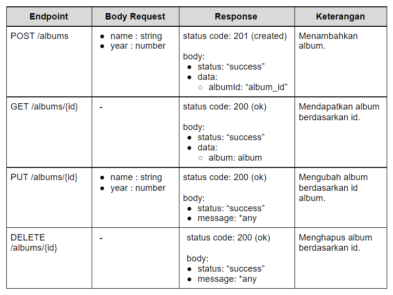
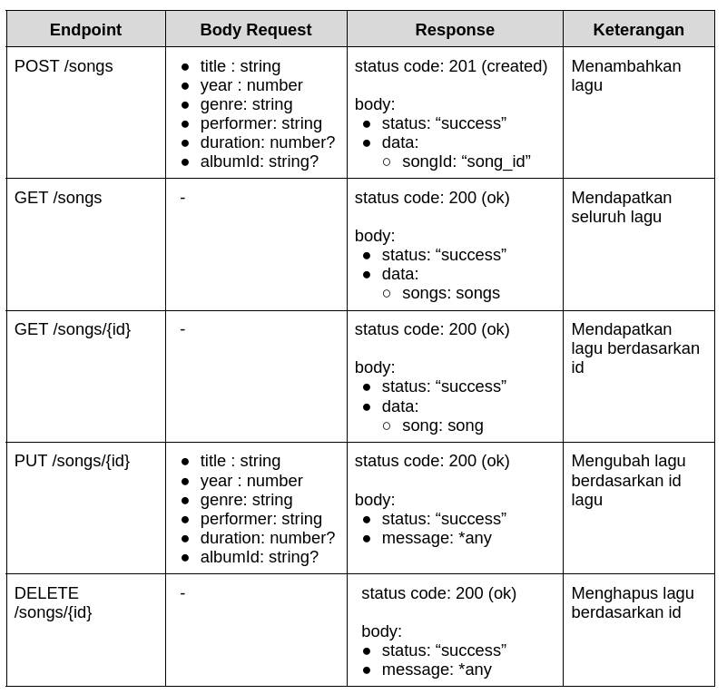
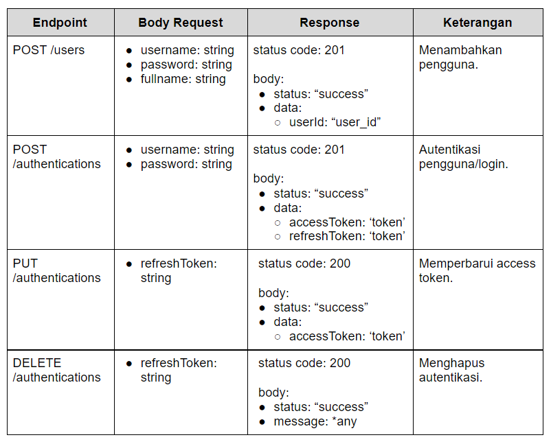
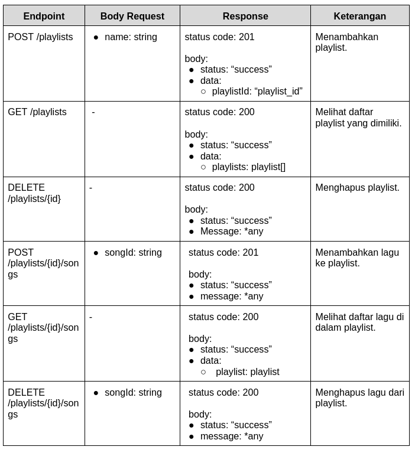
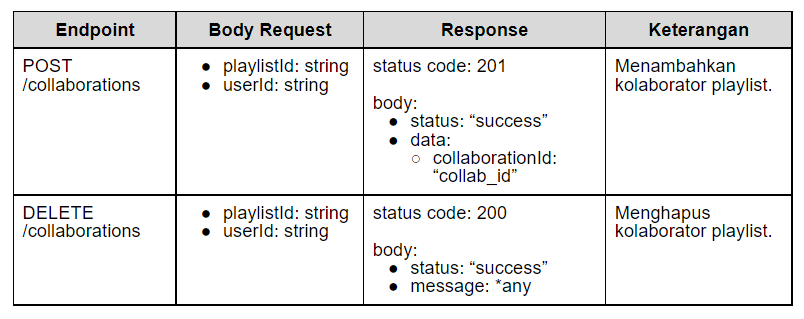

[class-link]: https://www.dicoding.com/academies/271
[pm-v1]: https://github.com/dicodingacademy/a271-backend-menengah-labs/raw/099-shared-files/03-submission-content/01-open-music-api-v1/OpenMusic%20API%20V1%20Test.zip
[pm-v2]: https://github.com/dicodingacademy/a271-backend-menengah-labs/raw/099-shared-files/03-submission-content/02-open-music-api-v2/OpenMusic%20API%20V2%20Test.zip

# dicoding-back-end-intermediate

Project task from [dicoding.com Back-End Intermediate Class][class-link].

This project is a learning outcome through the platform dicoding.com. The aim is to enable students to create a RestfulAPI rich in features, including data validations, database relations, and auth with JWT Token.

### **Postman collections and envs for testing this project:**

- [API.v1 test zip][pm-v1].
- [API.v2 test zip][pm-v2].


## Project Set Up

- Create the "**.env**" file with the following data below:

  ```perl
  # Server Config
  HOST=localhost
  PORT=5000

  # node-postgres Config
  PGUSER=<your psql user>
  PGHOST=<your psql host>
  PGPASSWORD=<your psql password>
  PGDATABASE=<your psql database name>
  PGPORT=<your psql port>

  # Token Config
  ACCESS_TOKEN_KEY=<random string>
  REFRESH_TOKEN_KEY=<random string>
  ACCESS_TOKEN_AGE=<duration in ms>
  ```

- Then run this command
  ```
  npm install
  npm run pgm up
  ```

**Note**:

If you do TRUNCATE tables, make sure to re-add default album data (id: album-unknown) into "**albums**" table

OR

Re-migrations from "**./migrations/1676095171675_add-constraint-on-songs-table.js**".

## List of Contents

- [TO DO API.v1](#to-do-apiv1)
- [TO DO API.v1 Details](#to-do-apiv1-details)
- [TO DO API.v2](#to-do-apiv2)
- [TO DO API.v2 Details](#to-do-apiv2-details)

# TO DO API.v1

[See TO DO API.v1 Details](#to-do-apiv1-details).

## Mandatory Tasks

- [x] Albums endpoint.
- [x] Songs endpoint.
- [x] Data validation.
- [x] Error handling.
- [x] Using Database.

## Optional Tasks

- [x] "/albums/{id}" endpoint response array of Song on Album too.
- [x] Query params for songs endpoint.

# TO DO API.v2

[See TO DO API.v2 Details](#to-do-apiv2-details).

## Mandatory Tasks

- [x] Registration and Authentication Users.
- [x] Playlist endpoint.
- [x] Implement Foreign Key on Database Tables.
- [x] Data validation for new endpoints.
- [x] Error handling for new endpoints.
- [x] Keep features from API.v1.

## Optional Tasks

- [x] Collaborations on Playlists Feature.
- [ ] Activities endpoint for Playlist Log History.
- [x] Keep optional features from API.v1.

# TO DO API.v1 Details

NavBar:
[Back to Top](#dicoding-back-end-intermediate) |
[Optional Tasks](#optional-tasks-2) |
[TO DO API.v2 Details](#to-do-apiv2-details)

## Mandatory Tasks

### **1. Albums Endpoint**



<p align="center">*any: Any <b>string,</b> but not <b>null</b>.</p>

Album obj structure:

```json
{
  "id": "album-<unique-id-here>",
  "name": "lorem ipsum",
  "year": 2012
}
```

### **2. Songs Endpoint**



<p align="center">*any: Any <b>string,</b> but not <b>null</b>.</p>
<p align="center">*?: Can be <b>null</b> or <b>undefined</b>.</p>

Song obj structures:

- Main structure.

```json
{
  "id": "song-<unique-id-here>",
  "title": "Lorem Ipsum",
  "year": 2008,
  "performer": "John Doe",
  "genre": "Indie",
  "duration": 120,
  "albumId": "album-id"
}
```

- Only for GET /songs endpoint.

```json
{
  "id": "song-<unique-id-here>",
  "title": "Life in Technicolor",
  "performer": "Coldplay"
}
```

### **3. Data Validations**

- POST /albums

  - **name**: string, required.
  - **year**: number, required.

- PUT /albums

  - **name**: string, required.
  - **year**: number, required.

- POST /songs

  - **title**: string, required.
  - **year**: number, required.
  - **genre**: string, required.
  - **performer**: string, required.
  - **duration**: number.
  - **albumId**: string.

- PUT /songs
  - **title**: string, required.
  - **year**: number, required.
  - **genre**: string, required.
  - **performer**: string, required.
  - **duration**: number.
  - **albumId**: string.

### **4. Error Handling**

- Validation Error Response:
  - status code: **400 (Bad Request)**
  - response body:
    ```json
    {
      "status": "fail",
      "message": <any but not null>,
    }
    ```
- Not Found Error Response:
  - status code: **404 (Not Found)**
  - response body:
    ```json
    {
      "status": "fail",
      "message": <any but not null>,
    }
    ```
- Server Error Response:
  - status code: **500 (Internal Server Error)**
  - response body:
    ```json
    {
      "status": "error",
      "message": <any but not null>,
    }
    ```

### **5. Using Database**

- Use PostgreSQL to store data. So the data will not be lost if the server is down.

- Use [dotenv](https://www.npmjs.com/package/dotenv) to manage environment variables that store credentials for accessing database.

## Optional Tasks

NavBar:
[Back to Top](#dicoding-back-end-intermediate) |
[Back to Mandatory Tasks](#to-do-apiv1-details)

### **1. "/albums/{id}" endpoint response array of Song on Album too**

Example:

```json
{
  "status": "success",
  "data": {
    "album": {
      "id": "album-Mk8AnmCp210PwT6B",
      "name": "Viva la Vida",
      "year": 2008,
      "songs": [
        {
          "id": "song-Qbax5Oy7L8WKf74l",
          "title": "Life in Technicolor",
          "performer": "Coldplay"
        }
      ]
    }
  }
}
```

### **2. Query Params for Songs Endpoint**

Make the **GET /songs** support query params for searching.

- **?title**: Search song based on title.
- **?performer**: Search song based on performer.

**Note**: Both queries can be combined ( ".../songs?title=lmao&performer=pisan" )

# TO DO API.v2 Details

NavBar:
[Back to Top](#dicoding-back-end-intermediate) |
[Optional Tasks](#optional-tasks-3) |
[TO DO API.v1 Details](#to-do-apiv1-details)

## Mandatory Tasks

### **1. Registration and Authentication Users**



<p align="center">*any: Any <b>string,</b> but not <b>null</b>.</p>

**Conditions**:

- **Username** must unique.
- Using JWT token for Auth.
- JWT token payload contains **userId**.
- JWT token secret key value stored on envs as **ACCESS_TOKEN_KEY** and **REFRESH_TOKEN_KEY**.

### **2.Playlist endpoint**



<p align="center">*any: Any <b>string,</b> but not <b>null</b>.</p>

**Conditions**:

- **Restrict** endpoint (Need "access token" to access).
- **GET /playlists** returns owned playlists (And collab playlists if exist).
- Collaborator (if exist) can access **songs** (add, get, and delete) from playlist, but only owners can delete their own playlists.
- Only valid **songId** can be add/delete to/from playlist.

**Responses**:

- GET /playlists

```json
{
  "status": "success",
  "data": {
    "playlists": [
      {
        "id": "playlist-Qbax5Oy7L8WKf74l",
        "name": "Lagu Indie Hits Indonesia",
        "username": "dicoding"
      },
      {
        "id": "playlist-lmA4PkM3LseKlkmn",
        "name": "Lagu Untuk Membaca",
        "username": "dicoding"
      }
    ]
  }
}
```

- GET /playlists/{id}/songs

```json
{
  "status": "success",
  "data": {
    "playlist": {
      "id": "playlist-Mk8AnmCp210PwT6B",
      "name": "My Favorite Coldplay",
      "username": "dicoding",
      "songs": [
        {
          "id": "song-Qbax5Oy7L8WKf74l",
          "title": "Life in Technicolor",
          "performer": "Coldplay"
        },
        {
          "id": "song-poax5Oy7L8WKllqw",
          "title": "Centimeteries of London",
          "performer": "Coldplay"
        },
        {
          "id": "song-Qalokam7L8WKf74l",
          "title": "Lost!",
          "performer": "Coldplay"
        }
      ]
    }
  }
}
```

**Obj Playlist for Database**:

```json
{
  "id": "playlist-Qbax5Oy7L8WKf74l",
  "name": "Lagu Indie Hits Indonesia",
  "owner": "user-Qbax5Oy7L8WKf74l"
}
```

### **3. Implement Foreign Key**

- Table **songs** related to **albums**.
- Table **playlists** related to **users**.
- etc.

### **4. Data Validation**

- POST /users

  - **username**: string, required.
  - **password**: string, required.
  - **fullname**: string, required.

- POST /authentications

  - **username**: string, required.
  - **password**: string, required.

- PUT /authentications

  - **refreshToken**: string, required.

- DELETE /authentications

  - **refreshToken**: string, required.

- POST /playlists

  - **name**: string, required.

- POST /playlists/{playlistId}/songs

  - **songId**: string, required.

### **5. Error Handling**

The previous error handler is still in use, but there is a new handler for Auth.

- Authorization Error:
  - status code: **401 (Unauthorized)**
  - response body:
    ```json
    {
      "status": "fail",
      "message": <Any, but not null>
    }
    ```
- Restrict Error:
  - status code: **403 (Forbidden)**
  - response body:
    ```json
    {
      "status": "fail",
      "message": <Any, but not null>
    }
    ```

### **6. Keep Features from API.v1**

- Albums Feature.
- Songs Feature.
- Validations for Songs and Albums Endpoints.

## Optional Tasks

NavBar:
[Back to Top](#dicoding-back-end-intermediate) |
[Back to Mandatory Tasks](#to-do-apiv2-details) |
[TO DO API.v1 Details](#to-do-apiv1-details)

### **1. Playlists Collaboration Feature**



<p align="center">*any: Any <b>string,</b> but not <b>null</b>.</p>

**Conditions**:

- Only the owner of the playlist can add or remove collaborators from the playlist.

**Collaborator access rights**:

- Collaborated playlists also shown on "GET /playlists" endpoint data.
- Can add/get/delete songs to/from playlist.
- Can see playlist activities too (If already implemented).

### **2. Activities endpoint for Playlist Log History**

This feature is used to record the history of adding or removing songs from playlists by users or collaborators.

Endpoint: **GET /playlists/{id}/activities**

Response example:

- Status Code: 200
- Body:
  ```json
  {
    "status": "success",
    "data": {
      "playlistId": "playlist-Mk8AnmCp210PwT6B",
      "activities": [
        {
          "username": "dicoding",
          "title": "Life in Technicolor",
          "action": "add",
          "time": "2021-09-13T08:06:20.600Z"
        },
        {
          "username": "dicoding",
          "title": "Centimeteries of London",
          "action": "add",
          "time": "2021-09-13T08:06:39.852Z"
        },
        {
          "username": "dimasmds",
          "title": "Life in Technicolor",
          "action": "delete",
          "time": "2021-09-13T08:07:01.483Z"
        }
      ]
    }
  }
  ```

### **3. Keep optional features from API.v1**

- Songs list from album detail.
- Query param for search songs.
